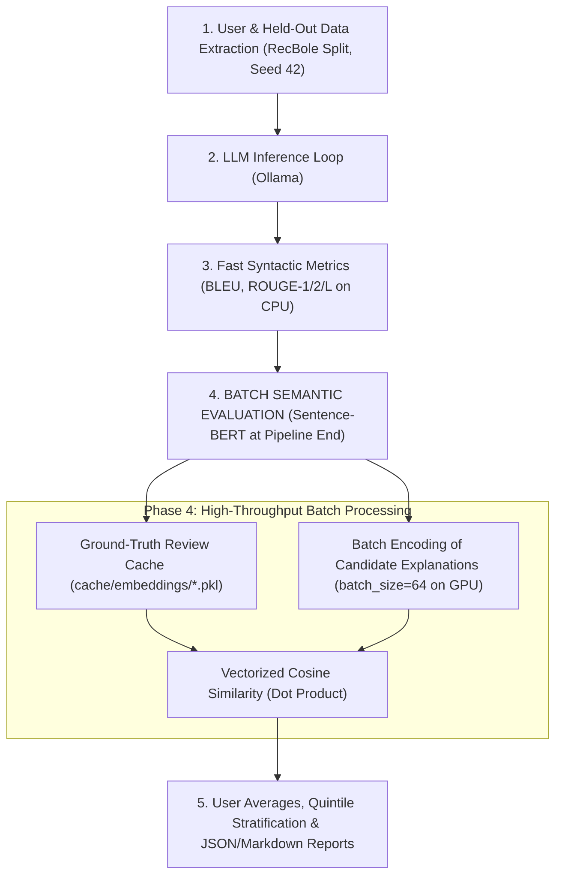

# DGCDR Cross-Domain LLM Explanation & Validation Framework

This framework enables generating personalized cross-domain recommendation explanations with a local LLM (**Qwen 3.5 9B** or other LLMs via Ollama) for the **DGCDR** (*Disentangled Graph Cross Domain Recommender*) model, and validating those explanations against actual user reviews on held-out items using both syntactic metrics (**BLEU**, **ROUGE-1**, **ROUGE-2**, **ROUGE-L**) and semantic similarity metrics via **Sentence-BERT** (cosine similarity).

---

## 📁 Project Architecture

```
DGCDR_/
├── llm_explainer/
│   ├── __init__.py           # Package exports
│   ├── config.py             # Domain pairs, file paths, default parameters
│   ├── metrics.py            # BLEU, ROUGE-1/2/L, SBERT, ReferenceEmbeddingCache, batch encoding
│   ├── ollama_client.py      # Ollama REST client (supports Qwen 3.5 9B with 32k context)
│   ├── markdown_exporter.py  # Markdown report exporter and results organizer
│   ├── prompt_builder.py     # Prompt formatter in English + prompt file writer
│   ├── data_extractor.py     # RecBole split loader (seed 42), text filter, instant cache loader
│   ├── quintiles.py          # Word count classification & review quintile stratification
│   └── compact_builder.py    # Preprocessor for lightweight compact metadata & reviews
├── saved_prompts/            # Saved prompts organized into subfolders per validation run
│   └── prompt_<domain_pair>_<model>_<timestamp>/
│       └── prompt_<user_id>.txt
├── results/                  # Validation reports partitioned by domain pair and LLM
│   └── <domain_pair>/        # e.g., Cloth-Elec/
│       └── <model_name>/     # e.g., llama3.1_8b/, qwen3.5_9b/
│           ├── <source>-<target>_<model>_<timestamp>.json
│           └── <source>-<target>_<model>_<timestamp>.md
├── cache/                    # Local caches for fast execution
│   ├── compact_<pair>.pkl    # Compact preprocessed dataset cache (< 1s load time)
│   └── embeddings/           # Persistent disk cache for reference review embeddings
│       └── ref_emb_<pair>_<sbert_model>.pkl
├── preprocess_compact_data.py # CLI script to build compact datasets (< 1s load time)
├── evaluate_results_quintiles.py # Standalone evaluation & quintile breakdown CLI
├── run_llm_validation.py     # Main CLI entry point
└── README_LLM_VALIDATION.md  # Documentation and usage guide
```

---

## ⚡ Optimized Embedding & Validation Pipeline

To support heavier Sentence-BERT and text-embedding models (e.g., *all-MiniLM-L6-v2*, *BGE-large*, *gte-large*, *NV-Embed*) while preventing GPU memory bottlenecks, the evaluation pipeline adopts an optimized batch-processing architecture:



### Key Architectural Advantages:
1. **Deferred SBERT Loading & Active VRAM Deallocation**:
   - The Sentence-BERT model is **not** loaded during LLM generation.
   - Once explanation generation is completed for all users, the framework automatically triggers an explicit unload command (`keep_alive=0`) via Ollama's API and invokes PyTorch's `cuda.empty_cache()`. This evicts the LLM weights and context from VRAM, freeing 100% of the GPU memory for the embedding model.
2. **Persistent On-Disk Cache for Reference Reviews**:
   - Because target held-out items and ground-truth reviews are deterministic (fixed RecBole seed `42`), their embeddings remain identical across different validation runs, prompts, temperatures, and LLMs.
   - Embeddings are indexed by SHA-256 hash in `cache/embeddings/ref_emb_<pair>_<model>.pkl`. On subsequent runs, reference embeddings achieve a **100% cache hit (~0 ms)**.
3. **GPU Batching & Vectorized Dot Product**:
   - Rather than encoding pairs one-by-one (`batch_size=2`), all candidate explanations across all users are encoded together using GPU batching (`--sbert_batch_size 64`).
   - Cosine similarity is computed in a single vectorized NumPy matrix operation (`np.sum(cand_embs * ref_embs, axis=1)`), boosting evaluation speed by **10x–50x**.

---

## 🚀 Quick Start

### 1. Requirements & Conda Environment
Activate the dedicated conda environment:
```powershell
conda activate dgcdr38
```

Ensure Ollama is running with your chosen model:
```powershell
ollama serve
# Verify model availability
ollama list
```

---

### 2. Running the Validation

#### Single user test:
```powershell
python run_llm_validation.py --num_users 1
```

#### Multi-user evaluation (e.g., 5 users):
```powershell
python run_llm_validation.py --num_users 5
```

#### Custom SBERT model and batch size:
```powershell
python run_llm_validation.py --num_users 10 --sbert_model all-MiniLM-L6-v2 --sbert_batch_size 64
```

#### Change domain pair (e.g., Clothing -> Sports & Outdoors):
```powershell
python run_llm_validation.py --domain_pair Cloth-Sport --num_users 3
```

#### Preprocessing Compact Datasets (< 1s load time):
To build or update the compact cache for a domain pair:
```powershell
python preprocess_compact_data.py --domain_pair Cloth-Elec
```
Or for all pairs at once:
```powershell
python preprocess_compact_data.py --all
```
This generates `cache/compact_<pair>.pkl` and `cache/compact_<pair>.json`, enabling instant sub-second loading for any number of users.

---

## ⚙️ CLI Arguments

| Argument | Type | Default | Description |
|---|---|---|---|
| `--num_users` | `int` | `5` | Number of test users to evaluate |
| `--domain_pair` | `str` | `Cloth-Elec` | Cross-domain pair (`Cloth-Elec`, `Elec-Cloth`, `Cloth-Sport`, `Sport-Cloth`) |
| `--seed` | `int` | `42` | Random seed matching RecBole split reproducibility |
| `--temperature` | `float` | `0.0` | LLM sampling temperature (0.0 for deterministic reproducibility) |
| `--rating_threshold` | `float` | `4.0` | Minimum rating for interaction history and held-out items |
| `--model` | `str` | `qwen3.5:9b` | Local Ollama model name |
| `--ollama_url` | `str` | `http://localhost:11434` | Ollama API endpoint |
| `--num_ctx` | `int` | `32768` | Ollama context window size |
| `--sbert_model` | `str` | `all-MiniLM-L6-v2` | Sentence-BERT model name for semantic similarity |
| `--sbert_batch_size` | `int` | `64` | Batch size for Sentence-BERT embedding encoding |
| `--no_cache_sbert` | `flag` | `False` | Disable on-disk caching of reference review embeddings |
| `--min_review_words` | `int` | `5` | Minimum words threshold to filter ultra-short reviews in quintiles |
| `--use_title_in_quintiles`| `flag`| `False` | Whether to include review title in quintile word count classification |
| `--prompts_dir` | `str` | `saved_prompts` | Directory where user prompts are saved |
| `--output_dir` | `str` | `results` | Directory where validation reports are saved |
| `--dry_run` | `flag` | `False` | Run with mock LLM explanations without querying Ollama |

---

## 📝 Generated Output Structure

### 1. Saved Prompts (`saved_prompts/prompt_<user_id>.txt`)
Each prompt includes:
- **DGCDR Model Definition**: Full name (*Disentangled Graph Cross Domain Recommender*) and cross-domain disentangled preference representation.
- **Source Domain History**: 100% (train + valid) items with rating $\ge 4.0$, title, review title, and review text.
- **Target Domain History**: 80% (train + valid) items with rating $\ge 4.0$, title, review title, and review text.
- **Recommended Items**: 20% target domain held-out items presented blindly as recommendations from DGCDR.
- **Strict English Instructions & JSON Schema**.

### 2. Validation Reports (`results/<domain_pair>/<model_name>/<source>-<target>_<model>_<timestamp>.json` and `.md`)
Every run automatically produces both a structured `.json` file and a human-readable companion `.md` (Markdown) report in the model-specific subdirectory:
- **`.json` report**: Contains full raw metrics, item-level evaluations, user averages, global macro averages, and review length quintile stratifications.
- **`.md` report**: Formatted summary tables (global macro averages, review quintiles, user breakdowns) and styled item-by-item comparison cards.

Sample JSON snippet:
```json
{
  "timestamp": "2026-09-28T11:12:09.549",
  "domain_pair": "Cloth-Elec",
  "source_domain": "Clothing, Shoes & Jewelry (Cloth)",
  "target_domain": "Electronics (Elec)",
  "model": "qwen3.5:9b",
  "sbert_model": "all-MiniLM-L6-v2",
  "seed": 42,
  "rating_threshold": 4.0,
  "min_review_words": 5,
  "num_users": 1,
  "total_held_out_items_evaluated": 2,
  "users": [
    {
      "user_id": "AE22AMGLNKESKOBMOMY7C2SURQTA",
      "prompt_file": ".../saved_prompts/prompt_Cloth-Elec_qwen3.5_9b_.../prompt_AE22AMGLNKESKOBMOMY7C2SURQTA.txt",
      "items": [
        {
          "id_item": "B08R3D8R9W",
          "item_title": "GoPro HERO6 Black ...",
          "user_review_title": "Great Action Camera",
          "user_review_text": "It has clear image, and i really love it",
          "review_word_count": 12,
          "quintile": "Q1",
          "quintile_label": "Micro",
          "is_filtered_ultrashort": false,
          "llm_explanation": "This recommendation leverages your interest in durable electronics...",
          "metrics": {
            "bleu": 0.0039,
            "rouge1_f1": 0.0704,
            "rouge1_p": 0.0385,
            "rouge1_r": 0.4444,
            "rouge2_f1": 0.0,
            "rouge2_p": 0.0,
            "rouge2_r": 0.0,
            "rougeL_f1": 0.0555,
            "rougeL_p": 0.0385,
            "rougeL_r": 0.1111,
            "sbert_similarity": 0.3125
          }
        }
      ],
      "user_averages": {
        "avg_bleu": 0.0039,
        "avg_rouge1_f1": 0.0704,
        "avg_rouge2_f1": 0.0,
        "avg_rougeL_f1": 0.0555,
        "avg_sbert_similarity": 0.2628
      }
    }
  ],
  "global_averages": {
    "macro_avg_bleu": 0.0039,
    "macro_avg_rouge1_f1": 0.0704,
    "macro_avg_rouge2_f1": 0.0,
    "macro_avg_rougeL_f1": 0.0555,
    "macro_avg_sbert_similarity": 0.2628
  }
}
```
